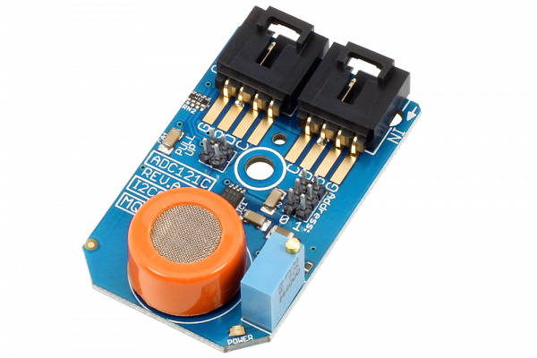

[](https://store.ncd.io/product/mq-3-alcohol-sensor-adc121c-12-bit-adc-i2c-mini-module/).

#  ADC121C_MQ3
 ADC121C_MQ3 is a MQ-3 Alcohol Sensor.ADC121C is a 12-Bit ADC I2C Mini Module.
This Device is available from www.ncd.io

[SKU:  ADC121C_MQ3_I2CS]

(https://store.ncd.io/product/mq-3-alcohol-sensor-adc121c-12-bit-adc-i2c-mini-module/)
This Sample code can be used with Raspberry Pi.

Hardware needed to interface ADC121C_MQ135 Sensor With Raspberry Pi : 

1. <a href="https://store.ncd.io/product/mq-135-nh3-amonia-benzene-alcohol-gas-sensor-adc121c-12-bit-adc-i%C2%B2c-mini-module/">ADC121C_MQ135 NH3 Amonia Benzene Alcohol Gas Sensor</a>

2. <a href="https://store.ncd.io/product/i2c-shield-for-raspberry-pi-3-pi2-with-outward-facing-i2c-port-terminates-over-hdmi-port/">Raspberry Pi I2C Shield</a>

3. <a href="https://store.ncd.io/product/i%C2%B2c-cable/">I2C Cable</a>

## Python

Download and install smbus library on Raspberry pi. Steps to install smbus are provided at:

https://pypi.python.org/pypi/smbus-cffi/0.5.1
Download (or git pull) the code in pi. Run the program.

```cpp

$> python ADC121C_MQ135.py

```

The lib is a sample library, you will need to calibrate the sensor according to your application requirement.

